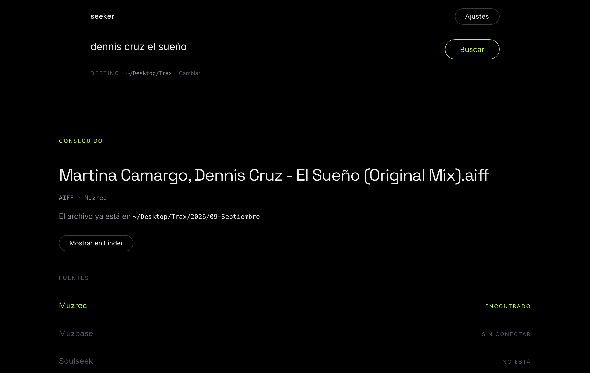

<h1 align="center">Seeker</h1>
<p align="center"><b>El buscador universal de tracks para DJs.</b></p>
<p align="center">Un nombre, un link o una playlist entera.<br>Seeker la busca en todas tus cuentas y baja cada track en calidad real, verificada.</p>

<p align="center">
  <a href="https://github.com/facundoalan81-cpu/seeker-releases/releases/latest"></a>
  <a href="https://github.com/facundoalan81-cpu/seeker-releases/releases"></a>
  
</p>

<p align="center">
  <a href="https://github.com/facundoalan81-cpu/seeker-releases/releases/latest"><b>⬇︎ Descargar para macOS</b></a>
</p>



## Qué hace

Pegás el nombre de un track y Seeker lo busca **fuente por fuente**, de la mejor calidad a la última, hasta que aparece. Baja **un solo archivo**: el mejor que encontró.

**Muzrec · Muzbase · Soulseek · Deezer · YouTube · SoundCloud**, y si en ninguna está, sale a buscarlo por la web abierta.

No te hace elegir. No te devuelve una lista. Te deja el archivo en la carpeta.

## Lo que lo hace distinto

**Verifica que la calidad sea real.** Analiza el espectro de cada archivo antes de quedárselo: si un "320" es en verdad un 128 re-encodeado, lo manda a `_fake/` y sigue buscando.

**Te dice la verdad.** Si una fuente no contesta, dice *"no se pudo consultar"* — no *"no está"*. Si pediste un remix y solo hay otra versión, te dice cuál hay en vez de bajarte el track equivocado.

**Corre en tu Mac, con tus cuentas.** Nada pasa por un servidor.

```
PIPELINE DE FUENTES                              terminado ✓
  Muzrec    ✓ encontrado      Muzbase   ✗ nada
  Soulseek  ✗ nada            Deezer    ✗ nada
  YouTube   — no se consultó  Web       — no se consultó

→ Tiga - Mind Dimension (Ben Sterling Remix).aiff · AIFF · 21.7 kHz · real
```

## Instalación

1. Bajá el `.dmg` desde **[Releases](https://github.com/facundoalan81-cpu/seeker-releases/releases/latest)** y arrastrá Seeker a Aplicaciones.
2. La primera vez, abrilo con **click derecho → Abrir**. La app no está firmada por Apple, así que el doble click te la va a rechazar.
3. En **Ajustes**, tocá *"Detectar mi sesión"* en las cuentas que uses. Lee la sesión del navegador donde ya estás logueado — Arc, Chrome, Brave, Safari, Firefox, Edge, Vivaldi u Opera.

Sin ninguna cuenta también funciona: quedan YouTube, SoundCloud y la búsqueda web.

macOS Apple Silicon.

## Preguntas

**¿Guarda mis contraseñas?** No salen de tu Mac. Viven en `~/Library/Application Support/TraxDownload/`.

**¿Y si no encuentra el track?** Te dice en qué fuentes buscó y qué encontró de parecido. Muchas veces el problema es el nombre: probá sin el remixer, o solo el título.

**¿Dónde caen los archivos?** En `~/Downloads/Seeker`. Lo cambiás en Ajustes.

---

Seeker corre en tu máquina y usa tus propias cuentas: no aloja ni distribuye música. Lo que bajes es responsabilidad tuya, igual que si lo buscaras a mano.
